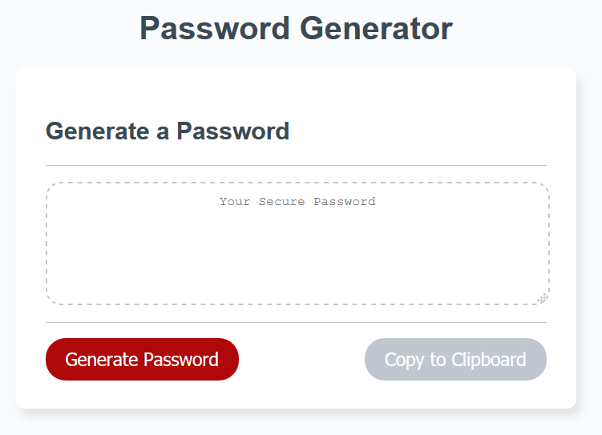

# week3

## Description 

This is a password generator for the week3. 

## Installation
Simply open your web browser and access to https://tak-9.github.io/week3/

## Usage 
1. Click "Generate Password" button. 
2. Enter character type (s, n, l or u) for password in the dialog box. 
3. Enter password length from 8 to 128.  
4. Generated password is displayed. Click on "Copy to Clipboard" if required. 

## Screen Capture 
 

